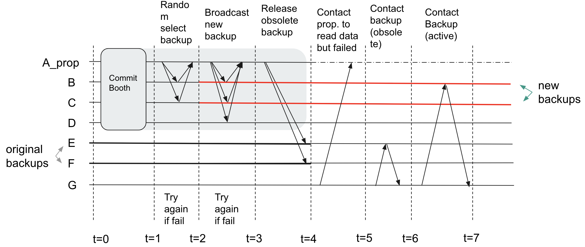

# VGuard_DB
An on-chain temporary storage extension for VGuard blockchain system.

## Highlevel Overview

**Key goals**: Create a Distributed, Available, Storage-efficient database for VGuard.
**Key Components**: 3 Components: 1)Replicate, 2)Storage release, 3)Read
- (Sync within booth) Data Replicate:
    - After each consensus, the proposer randomly selects N+1 vehicles with available storage space as backups for all of its local data.
- (Async) Storage Release:
    - Proposer periodically informs obsolete backups that they are free to release (delete) their local data in exchange of forwarding any incoming requests to the active backups.
- (Async) Read:
    - A non proposer reaches out to the proposer for data first, and if that fails;
    - Reach out to one of the backups according to its local backup table.
        - If the backup is active, it will return the data directly.
        - If the backup is obsolete, it will return the id (address) of the active replica, which the requester can use to update its local backup table.
        - Go back and try again.

The figure below shows an overall Work flow overview for VGuard_DB, where A_prop is the proposer, and B-G are participating vehicles. The number of backups is set to k=2.



##Quick Start

**Note:** VGuardDB is implemented via a PythonFlask API. It can be run independently from VGuard, and all of its actions from data replication to read can be trigger via simple ResfulAPI calls. To run VGuard alongside VGuardDB, consult VGuard quick start guide.

**To start an instance of proposer** for VGuardDB, run the following command:

`python server_api.py --is_proposer true --id 0 --port 9860 --k_backups <number of backups>
`

It is possible to change `id` and `port` in the above command, but by convention we typically assign proposer with an `id 0`.

**To start an instance of a non-proposer**, run the following command in a separate terminal (so it can be run in a separate thread).

`python server_api.py --id <id> --port <port>
`

Where `id` and `port` are unique integer values.

**To trigger the replication process**, send a Get request to the proposer's "end_of_booth" end point. For example, in python:

```python
import requests

requests.get('http://127.0.0.1:9860/end_of_booth', json={"participants":[4,5,6]})
```

**To trigger data read on a non-proposer instance**, send a Get request to the desired server's "trigger_read" end point. 
For exaple, in python:

```python
import requests

requests.get('http://127.0.0.1:9861/trigger_read')
```


